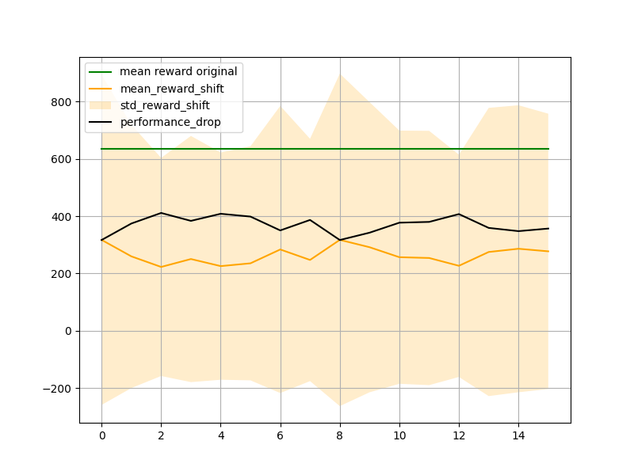

[](https://github.com/AI4REALNET/T4.2_Domain_Shift_KPIs/actions)
# T4.2_Domain_Shift_KPIs
The repository provides a list of functions to compute the domain shift KPIs introduced in D4.1 of the project.

## The list of KPIs
- [x]  KPI-DF-052 [Domain shift adaptation time](domain_shift_kpis/adapation_time/README.md)

- [ ] KPI-DF-053 Domain shift generalization gap 
- [ ] KPI-DF-054 Domain shift out of domain detection accuracy
- [ ] KPI-DF-055 Domain shift policy robustness
- [ ] KPI-DF-056 Domain shift robustness to domain parameters
- [ ] KPI-DF-057 Domain shift success rate drop
- [ ] KPI-DF-090 Domain shift forgetting rate

## Installation guide
Create an environment using Conda (recommended)
```bash
conda create -n env_name python=3.8
conda activate env_name
```

Create a virtual environment
```bash
cd my-project-folder
pip3 install -U virtualenv
python3 -m virtualenv my_env
source my_env/bin/activate
```

Install the dependencies for a spcific use case
```bash
pip install -U ".[<use_case>]"
```

To contribute
```bash
pip3 install -e ".[<use_case>]"
```

The `<use_case>` could be one of the the following:
- `power_grids`: Already implemented. Provides the dependencies for power grid digital environment (grid2Op).
- `railway`: TO BE IMPLEMENTED. It will provide the dependencies for railway digital environment (flatland)
- `atm`: TO BE IMPLEMENTED. It will provide the dependencies for air traffic management digital environment (BlueSky).

## Requirements
Two major requirements for these KPIs are:
1. **Agent**:
You should provide an agent with the file including the trained weights. The agent class should implement a `load` function which gets the path to the trained weights and allows to load correctly the agent which should be evaluated, as well as to be further trained on new set of data. You should also provide two supplementary functions for training and evaluation of the agent. These functions with their corresponding arguments are passed to KPI `compute` function as follows:

```python
from domain_shift_kpis import KPI
from my_agent import MyAgent, train, evaluate

my_kpi = KPI(agent=MyAgent,
             trained_model_path="path_to_weights",
             env=env,
             env_shift=env_shift
            )

results = my_kpi.compute(agent_train_fun=train,
                         agent_train_kwargs=train_kwargs,
                         agent_eval_fun=evaluate,
                         agent_eval_kwargs=eval_kwargs
                         )
```

2. **Environments**: Two gym like environments allowing to simulate normal (`env` arguments in `KPI` call) and domain shift (`env_shift` argument) distributions. For an example of these environments for power grid domain, the shifted environment enables the power line disconnection through an opponent, which is disabled in the original environment (see [here](domain_shift_kpis/agents/power_grids/utils.py) for the implementation). 

## A working example
Herein, we take [domin shift adaptation time](domain_shift_kpis/adapation_time/domainShiftAdaptationTime.py) as one of the KPIs in this library to illustrate how it could be computed for an agent.

```python
from grid2op.Reward import LinesCapacityReward
from domain_shift_kpis import here
from domain_shift_kpis.agents.power_grids.custom_agent import train, evaluate
from domain_shift_kpis.agents.power_grids.utils import create_env, create_env_op, make_agent

seed = 42
obs_attr_to_keep = ["rho"]
act_attr_to_keep = ["set_bus"]
env_name = "l2rpn_case14_sandbox"
reward_class = LinesCapacityReward

env, env_gym = create_env(env_name, 
                          reward_class=reward_class, 
                          obs_attr_to_keep=obs_attr_to_keep, 
                          act_to_keep=act_attr_to_keep,
                          seed=seed)

env_shift, env_gym_shift = create_env_op(env_name,
                                         reward_class=reward_class, 
                                         obs_attr_to_keep=obs_attr_to_keep, 
                                         act_to_keep=act_attr_to_keep,
                                         seed=seed)

agent = make_agent(name="PPO_SB3", env=env, env_gym=env_gym)
model_path = os.path.join(here, "..", "trained_models", "PPO_SB3", "PPO_SB3.zip")

ds_kpi = DsAdaptationTime(agent=agent, 
                          trained_model_path=model_path, 
                          env=env_gym, 
                          env_shift=env_gym_shift
                          )
save_path = os.path.join(here, "..", "trained_models", "PPO_SB3_FINETUNE")

train_kwargs = {
    "train_steps": int(1e3),
    "load_path": model_path,
    "save_path": save_path,
    "save_freq": 5000,
}

eval_kwargs = {
    "n_eval_episodes": 10,
    "render": False,
    "deterministic": True,
    "return_episode_rewards": True
}

results = ds_kpi.compute(acceptance_threshold=200.,
                         fine_tune_budget=int(15e3),
                         agent_train_fun=train,
                         agent_train_kwargs=train_kwargs,
                         agent_eval_fun=evaluate,
                         agent_eval_kwargs=eval_kwargs,
                         min_train_steps=int(1e3),
                         save_path=save_path
                         )
return results
```

The output variable representing the results of the KPI (`results`) is a dictionary with the following keys:
- `status`: A boolean that becomes `True` if the agent were able to adapt its strategy, i.e., the difference of performance between original and shifted distribution is less than an `acceptance_threshold`. This threshold is set to $200$ in the above example.
- `performance_drop`: A list representing the drop in performance when the agent is evaluated on the shifted distribution in comparison to the original one. It is traced through the adaptation period.
- `adaptation_time`: An integer representating the number of iterations required by the agent to adapt its strategy. When `status` is `False`, this shows only the number of iterations that the agent tried without success to adapt its strategy.

## Performance visualization
Once the KPI computed, the history of the agent's performance trying to adapt its policy to domains shift are stored. This history could be visualized easily using the plotting capabilities provided as follows:
```python
from domain_shift_kpis.adaptation_time.utils import plot_history

file_name = "history.json"
file_path = "path_to_the_history"
plot_history(os.path.join(file_path, file_name))
```


As can be seen in this image, the considered agent were not able to adapt its strategy to domain shift, and the performance (rewards) remains enough below its performance on original distribution.
