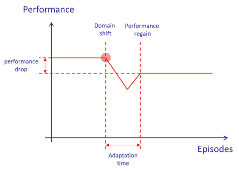

# Description 
The time or number of episodes required for the agent to regain a specific level of performance in the shifted domain after the domain shift has occurred. It can be used to evaluate how quickly an agent can adapt to new environmental conditions.  

# Objective
Domain adaptation (DA) is a sub-field of transfer learning. DA can be defined as the capability to deploy a model trained in one or more source domains into a different target domain. We consider that the source and target domains have the same feature space. In this sense, it is important for RL based agents to have a reasonable adaptation time to a new domain which may present a slight shift from the source domain. However, the adaptation time should also consider the performance drop into its computation, as a high performance drop after the adaptation could not be tolerated.  

This KPI contributes to evaluating Reliability of the AI-based assistant when dealing with real-world conditions which may be slightly different from source domain, as part of Task 4.2 evaluation objectives, and O4 main project objective. 

# Formula
The adaptation time could be computed as the sum of episodes required for an agent to regain a specific level of performance in the shifted domain after the domain shift has occurred. It could be presented schematically as follows:

In term of formula, we can compute it as: 

$\sum_{t=t_{shift}}^T 1 \{R_{t_{shift}-1} - R_t > \epsilon\}$ 

Where 1 is indicator function and becomes one when the difference between the reward computed before the occurrence of the domain shift (
$t_{shift}-1$) and the reward at the time steps after the domain shift ($[t_{shift};T]$) is higher than a threshold $\epsilon$. The value of the threshold could be dependent to the domain and the sensitivity.  

# Unit of the measurement
Time in terms of number of time steps or number of episodes required for an agent to adapt its policy to domain shift.